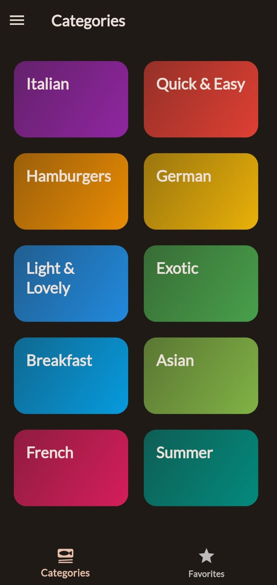
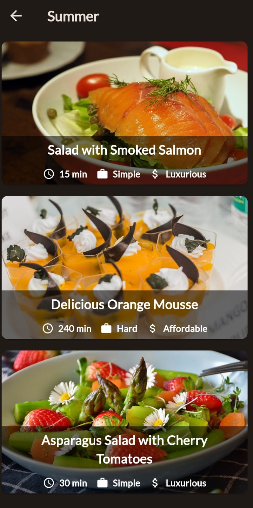
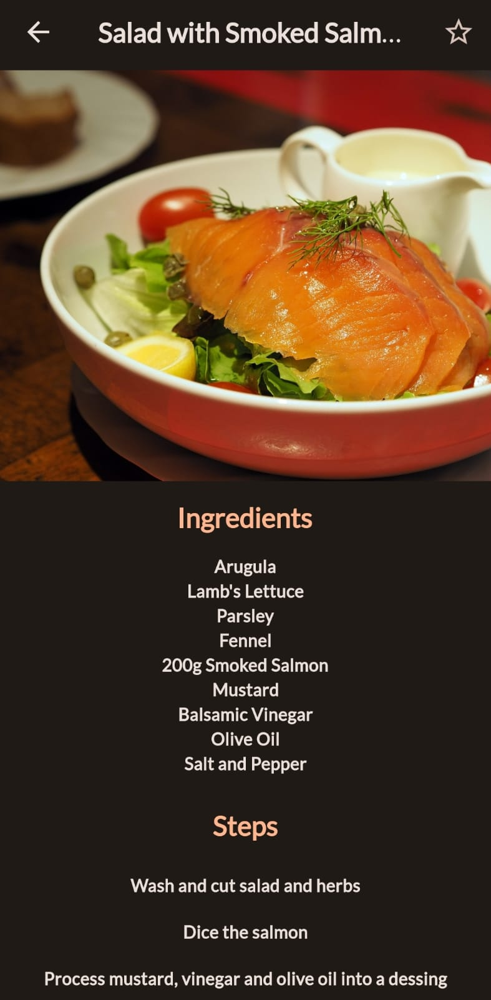

# meal_1

A new Flutter project.
# Screenshots
<table>
  <tr>
    <td>Home Page</td>
     <td>Drawer</td>
  </tr>
  <tr>
    <td></td>
    <td></td>
  </tr>
 </table>
 <table>
  <tr>
    <td>Items </td>
     <td>Ingridients</td>
  </tr>
  <tr>
    <td></td>
    <td></td>
  </tr>
 </table>

## Getting Started

This project is a starting point for a Flutter application.

A few resources to get you started if this is your first Flutter project:

- [Lab: Write your first Flutter app](https://docs.flutter.dev/get-started/codelab)
- [Cookbook: Useful Flutter samples](https://docs.flutter.dev/cookbook)

For help getting started with Flutter development, view the
[online documentation](https://docs.flutter.dev/), which offers tutorials,
samples, guidance on mobile development, and a full API reference.

This is the new readme line
